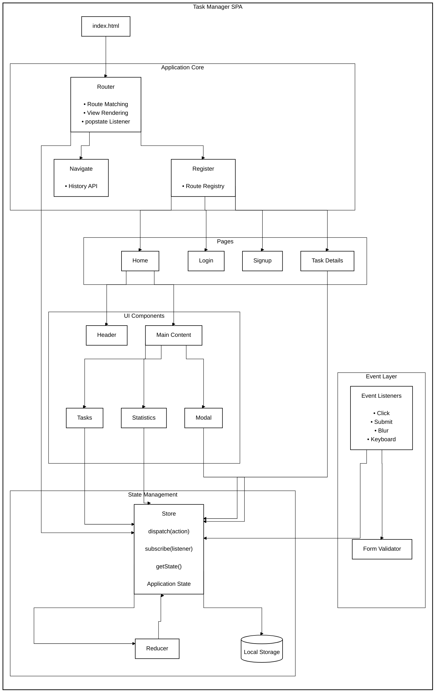

### Component Diagram

```mermaid
---
config:
  theme: base
  layout: dagre
  flowchart:
    curve: stepBefore
  themeVariables:
    background: "#ffffff"
    primaryColor: "#ffffff"
    primaryBorderColor: "#000000"
    primaryTextColor: "#000000"
    clusterBkg: "#ffffff"
    clusterBorder: "#000000"
    lineColor: "#000000"
    textColor: "#000000"
---
flowchart LR

subgraph System["Task Manager SPA"]

%%==================================================
%% Entry
%%==================================================

Index["index.html"]

%%==================================================
%% Core
%%==================================================

subgraph Core["Application Core"]

Router["Router

• Route Matching
• View Rendering
• popstate Listener"]

Register["Register

• Route Registry"]

Navigate["Navigate

• History API"]

end

%%==================================================
%% Pages
%%==================================================

subgraph Pages

Home["Home"]
Login["Login"]
Signup["Signup"]
Details["Task Details"]

end

%%==================================================
%% Components
%%==================================================

subgraph Components["UI Components"]

Header["Header"]

Main["Main Content"]

Tasks["Tasks"]

Stats["Statistics"]

Modal["Modal"]

end

%%==================================================
%% Events
%%==================================================

subgraph Events["Event Layer"]

Listeners["Event Listeners

• Click
• Submit
• Blur
• Keyboard"]

Validator["Form Validator"]

end

%%==================================================
%% State
%%==================================================

subgraph State["State Management"]

Store["Store

dispatch(action)

subscribe(listener)

getState()

Application State"]

Reducer["Reducer"]

Storage[("Local Storage")]

end

%%==================================================
%% Flow
%%==================================================

Index --> Router

Router --> Register
Router --> Navigate
Router --> Store

Register --> Home
Register --> Login
Register --> Signup
Register --> Details

Home --> Header
Home --> Main

Main --> Tasks
Main --> Stats
Main --> Modal

Tasks --> Store
Stats --> Store
Details --> Store
Modal --> Store

Listeners --> Store
Listeners --> Validator

Store --> Reducer
Reducer --> Store

Store --> Storage

end

%%==================================================
%% Styling
%%==================================================

classDef default fill:#ffffff,stroke:#000000,color:#000000,stroke-width:1.5px;

style System fill:#ffffff,stroke:#000000,stroke-width:2px

style Core fill:#ffffff,stroke:#000000
style Pages fill:#ffffff,stroke:#000000
style Components fill:#ffffff,stroke:#000000
style Events fill:#ffffff,stroke:#000000
style State fill:#ffffff,stroke:#000000
```
